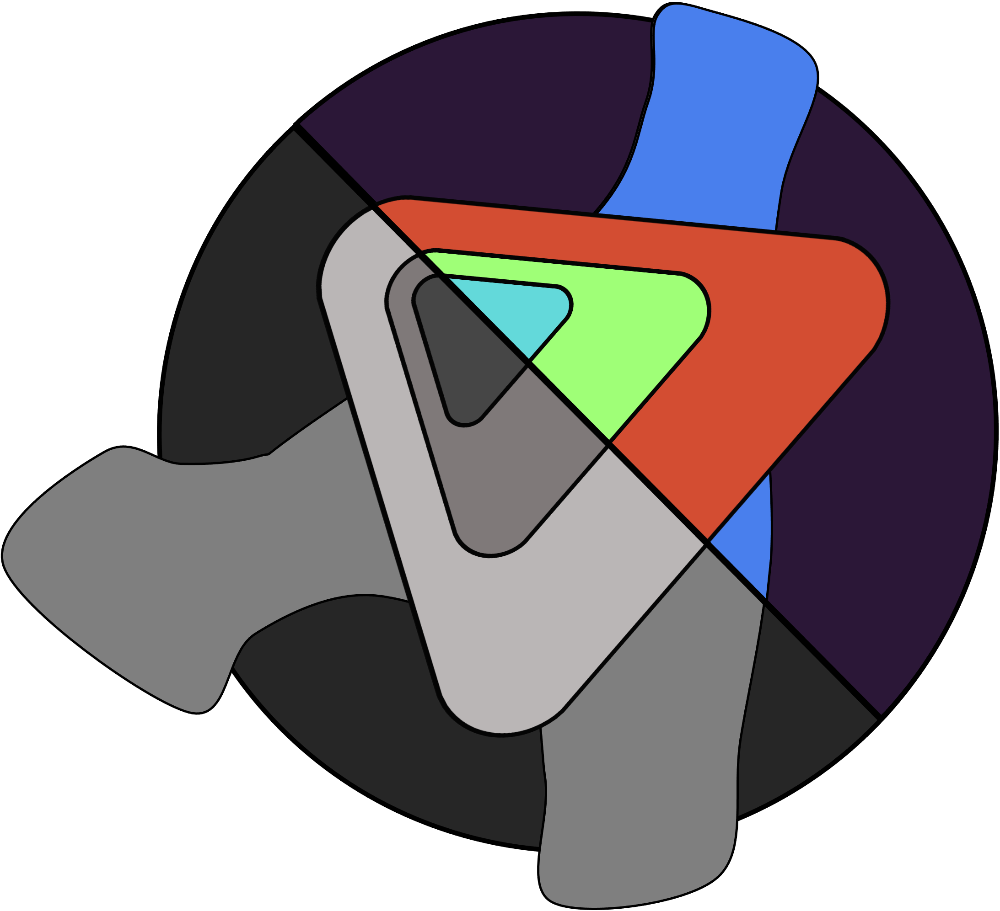

<!--
*** Thanks for checking out the Best-README-Template. If you have a suggestion
*** that would make this better, please fork the repo and create a pull request
*** or simply open an issue with the tag "enhancement".
*** Don't forget to give the project a star!
*** Thanks again! Now go create something AMAZING! :D
-->

<!-- PROJECT SHIELDS -->
<!--
*** I'm using markdown "reference style" links for readability.
*** Reference links are enclosed in brackets [ ] instead of parentheses ( ).
*** See the bottom of this document for the declaration of the reference variables
*** for contributors-url, forks-url, etc. This is an optional, concise syntax you may use.
*** https://www.markdownguide.org/basic-syntax/#reference-style-links
-->

<!-- PROJECT LOGO -->
 

  

<h3 align="center">STEMseg</h3>

  

    Help the processing of 4D-STEM data, specifically automatically clustering similar pixels in SEND pencil beam data 
     
    <a href="https://github.com/andy-bridger/stemsegment"><strong>Explore the docs »</strong></a>
     
     
    <a href="https://github.com/andy-bridger/stemsegment/tree/main/example-notebooks">View Demo</a>
    ·
    <a href="https://github.com/andy-bridger/stemsegment/issues">Report Bug</a>
    ·
    <a href="https://github.com/andy-bridger/stemsegment/issues">Request Feature</a>
  

<!-- TABLE OF CONTENTS -->

  
Table of Contents

  <ol>
    <li>
      <a href="#about-the-project">About The Project</a>
      <ul>
        <li><a href="#built-with">Built With</a></li>
      </ul>
    </li>
    <li>
      <a href="#getting-started">Getting Started</a>
      <ul>
        <li><a href="#prerequisites">Prerequisites</a></li>
        <li><a href="#installation">Installation</a></li>
      </ul>
    </li>
    <li><a href="#usage">Usage</a></li>
    <li><a href="#roadmap">Roadmap</a></li>
    <li><a href="#contributing">Contributing</a></li>
    <li><a href="#license">License</a></li>
    <li><a href="#contact">Contact</a></li>
    <li><a href="#acknowledgments">Acknowledgments</a></li>
  </ol>

<!-- ABOUT THE PROJECT -->
## About The Project

Intended for processing 4D-STEM datasets using an autoencoder trainer and a DataWrapper for processing the samples. The example notebooks should walkthrough the process of training the encoder and using it to cluster regions with similar diffraction data automatically.

<!-- RUNNING ON DLS-JUPYTERHUB -->
## Running on the DLS-JUPYTERHUB

- In order to use, boot up a GPU kernel and replace the container image with: CONTAINER_IMAGE=gcr.io/diamond-pubreg/container-tools/jhub-notebook:cuda10.1

- Select the EPSIC3.7 environment to run the example notebooks

<!-- CONTRIBUTING -->
## Contributing

Contributions are what make the open source community such an amazing place to learn, inspire, and create. Any contributions you make are **greatly appreciated**.

If you have a suggestion that would make this better, please fork the repo and create a pull request. You can also simply open an issue with the tag "enhancement".
Don't forget to give the project a star! Thanks again!

1. Fork the Project
2. Create your Feature Branch (`git checkout -b feature/AmazingFeature`)
3. Commit your Changes (`git commit -m 'Add some AmazingFeature'`)
4. Push to the Branch (`git push origin feature/AmazingFeature`)
5. Open a Pull Request

(<a href="#top">back to top</a>)

<!-- LICENSE -->
## License

Distributed under the MIT License. See `LICENSE.txt` for more information.

(<a href="#top">back to top</a>)

<!-- CONTACT -->
## Contact

Andy Bridger - andrew.bridger@univ.ox.ac.uk

Project Link: [https://github.com/andy-bridger/stemsegment](https://github.com/andy-bridger/stemsegment)

(<a href="#top">back to top</a>)

<!-- ACKNOWLEDGMENTS -->
## Acknowledgments

* 
* 
* 

(<a href="#top">back to top</a>)

